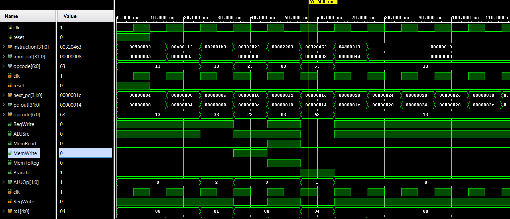
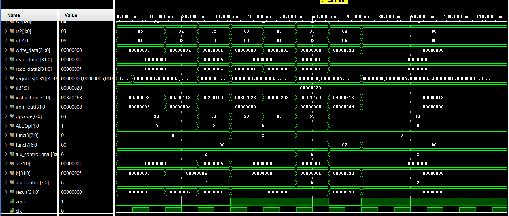
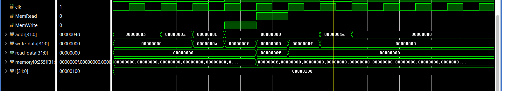

# RISC-V Single-Cycle CPU on Spartan-7 FPGA

## Overview

This project implements a **32-bit single-cycle RISC-V processor in Verilog HDL** and deploys it on a **Xilinx Spartan-7 FPGA**.

The processor implements the complete basic datapath, including the Program Counter, Instruction Memory, Control Unit, Register File, Immediate Generator, ALU Control, ALU, Data Memory, and branch logic.

The design was verified using simulation waveforms and implemented on FPGA hardware.

---

## Features

- 32-bit single-cycle RISC-V processor
- Verilog HDL implementation
- Modular datapath and control-path design
- Register file with 32 registers
- Arithmetic and logical operations
- Immediate instruction support
- Load and store operations
- Conditional branch support
- Instruction and data memory
- Simulation-based functional verification
- FPGA implementation on Xilinx Spartan-7

---

## Architecture

The processor follows a single-cycle architecture where each instruction is fetched, decoded, executed, and completed within one clock cycle.

### Main Modules

| Module | Function |
|---|---|
| Program Counter | Stores and updates the current instruction address |
| Instruction Memory | Stores processor instructions |
| Control Unit | Generates control signals based on the opcode |
| Register File | Provides source operands and stores results |
| Immediate Generator | Extracts and sign-extends immediate values |
| ALU Control | Generates the required ALU operation |
| ALU | Performs arithmetic and logical operations |
| Data Memory | Handles load and store operations |
| Branch Logic | Selects the next PC based on branch conditions |

### Datapath

```text
                    ┌─────────────────────┐
                    │         PC          │
                    └──────────┬──────────┘
                               │
                               ▼
                    ┌─────────────────────┐
                    │ Instruction Memory  │
                    └──────────┬──────────┘
                               │
                 ┌─────────────┴─────────────┐
                 ▼                           ▼
        ┌─────────────────┐         ┌─────────────────┐
        │  Control Unit   │         │ Immediate Gen   │
        └─────────────────┘         └────────┬────────┘
                                             │
                               ┌─────────────▼─────────────┐
                               │       Register File        │
                               └─────────────┬─────────────┘
                                             │
                                             ▼
                                      ┌─────────────┐
                                      │     ALU     │
                                      └──────┬──────┘
                                             │
                              ┌──────────────┴──────────────┐
                              ▼                             ▼
                       ┌─────────────┐               ┌─────────────┐
                       │ Data Memory │               │ Branch Logic│
                       └──────┬──────┘               └─────────────┘
                              │
                              ▼
                       ┌─────────────┐
                       │ Write Back  │
                       └──────┬──────┘
                              │
                              ▼
                       ┌─────────────┐
                       │ Register File│
                       └─────────────┘
```






### FPGA Implementation
Verilog RTL
     │
     ▼
Functional Simulation
     │
     ▼
Synthesis
     │
     ▼
Implementation
     │
     ▼
Bitstream Generation
     │
     ▼
Xilinx Spartan-7 FPGA

Author:
Osheen Mahajan

Engineering Project | RISC-V Processor Design and FPGA Implementation
